# Custom card component

custom-card-component

## Getting Started

### Prerequisites

- UI Framework installed and configured configured with profile (steps 1-3 from https://creator-dna.com/blog/macos-setup).
- Node, not newest version, v12.16.1 is mentioned on https://developer.servicenow.com/dev.do#!/reference/now-experience/sandiego/cli/faqs (seems to work just fine with v14.20.0).
- Python 2

### Installation

1. Clone this repository
2. Run `npm install` in your terminal
3. Run `snc ui-component deploy` in your terminal

## How To Use
---
### Add Component

1. Navigate to UI Builder in App Engine Studio
2. Add repeater component to your page
3. Locate and nest your custom component inside of repeater component

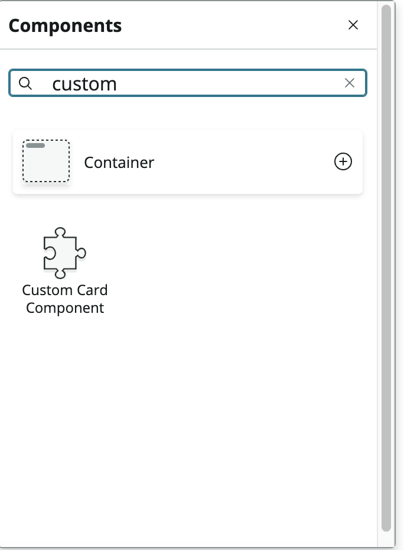
 
### Bind Data

#### Create a Data Resource Instance.

1. Start by click "Data" on the bottom left corner.

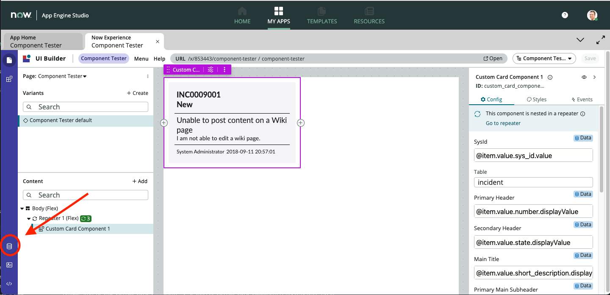

2. Click "+ Add".

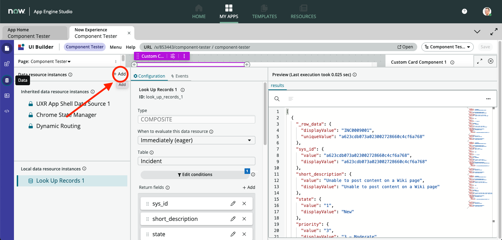

3. Add application and data resource and click "Add".

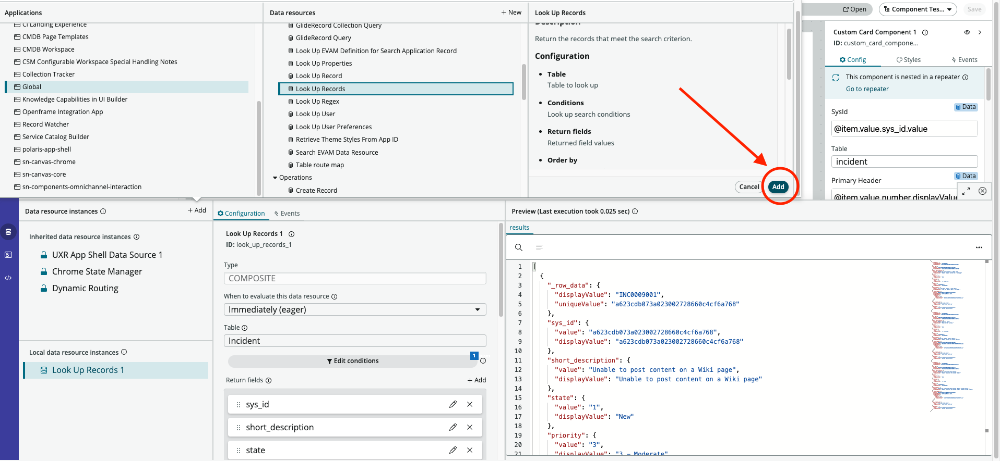

4. Choose table you want to use and make sure you are returning sys_id as one of the fields.

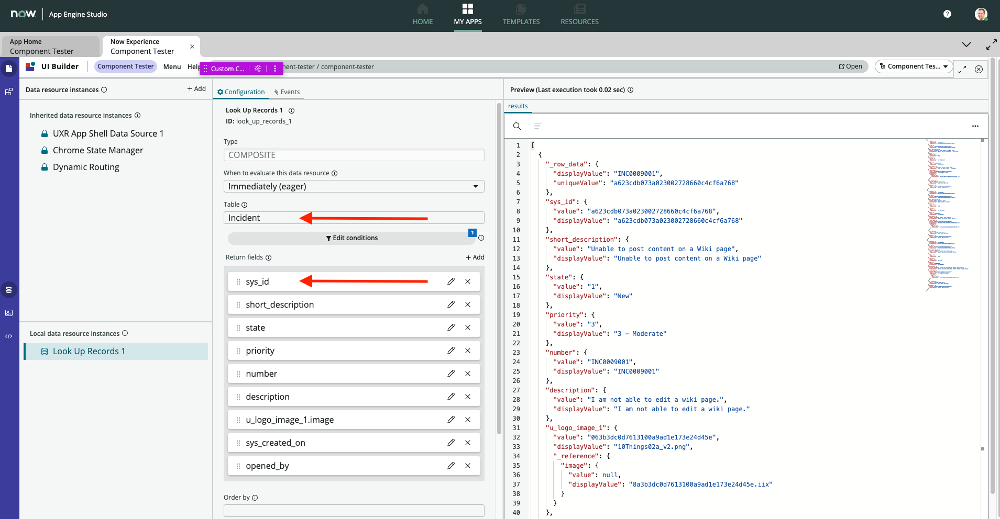

5. Make sure custom component is inside of repeater and bind data from the data resource you built.

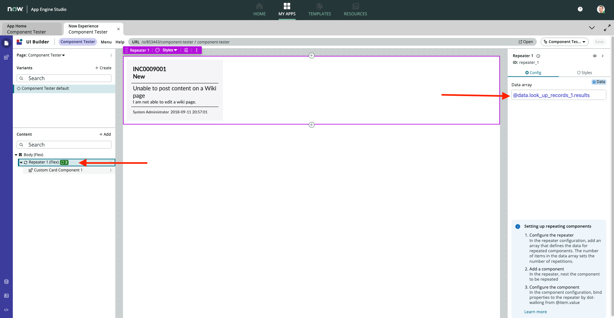

6. Bind data into your custom component and make sure to add at least the sysId and table.

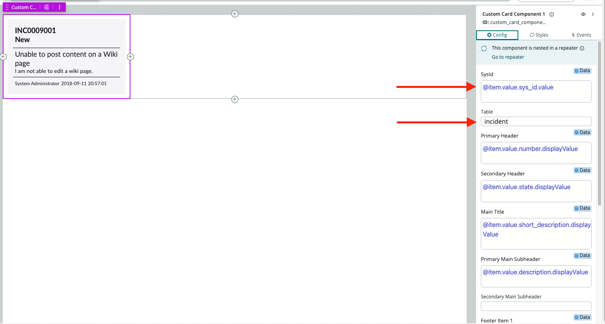

### Assign Event

1. Check Events tab under you custom component

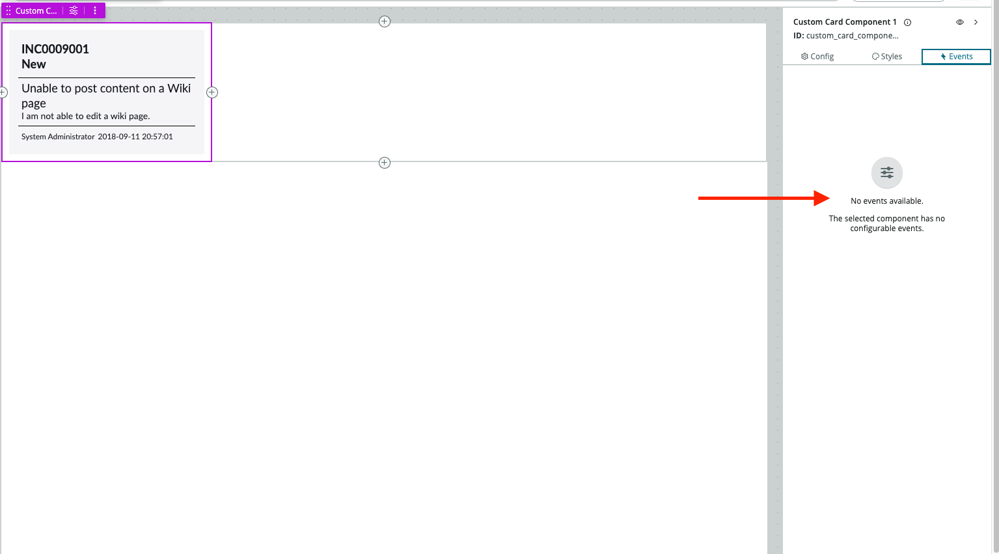

2. If there is nothing there, open new tab and go to "Your instance name here".service-now.com/sys_ux_event_list or search sys_ux_event.list.

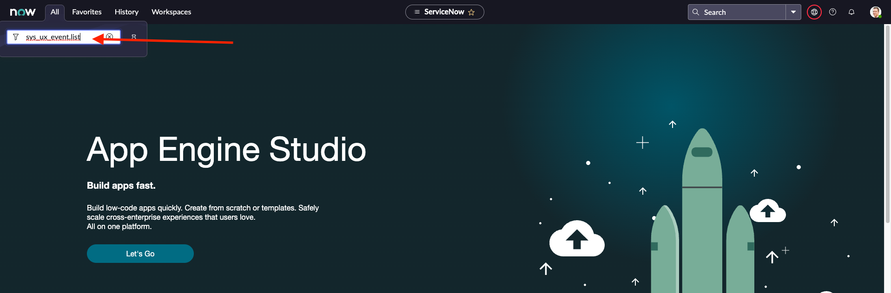

3. Click "New" to create event.
4. Add label name and event Name (event name should be the same from index.js file under "actionHandlers").
5. Double check the application is correct.
6. Inside of Porperties you want to list the ones you plan to use. 
---
Example for sys_id and table:
    
    [
        {
            "name":"sysId",
            "fieldType":"string",
            "label":"SysId",
            "interfaceApiName":"global.route",
            "typeMetadata":null,
            "mandatory":false,
            "readOnly":false
        },
        {
            "name":"table",
            "fieldType":"string",
            "label":"Table",
            "interfaceApiName":"global.route",
            "typeMetadata":null,
            "mandatory":false,
            "readOnly":false
        }
    ]
    
---
7. Save event.
8. Head to "Your instance name here".service-now.com/sys_ux_macroponent_list.do or search sys_ux_macroponent.list
9. Search for the component name and open.
10. At the top of the page you might need to click "here" in order to edit record.

 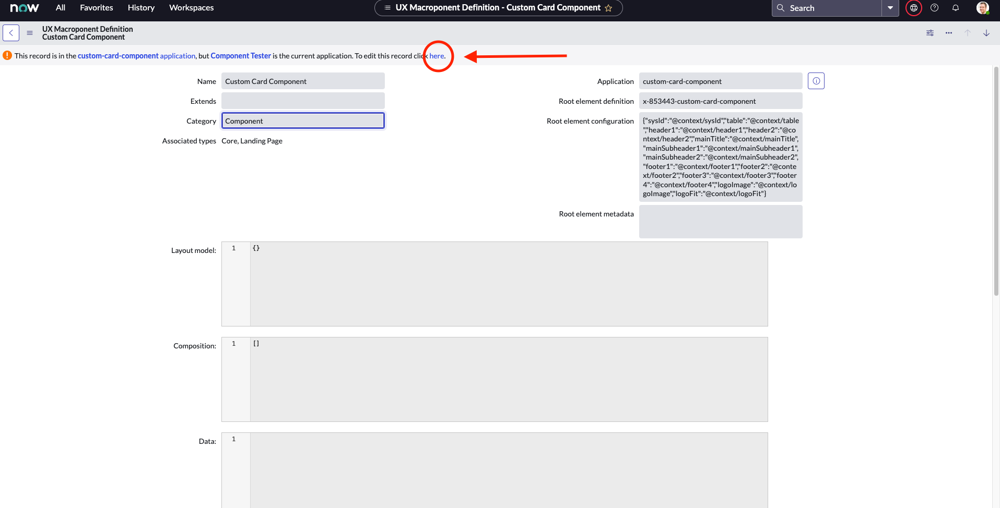

11. Scroll down to "Dispatched Events", add the event you created by searching the label name. 

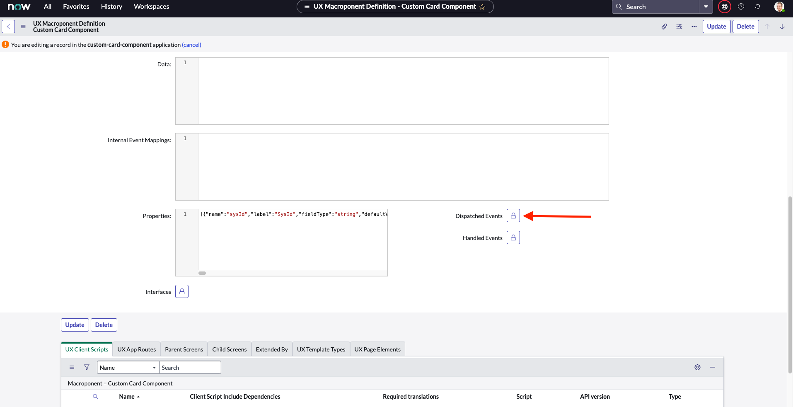

12. Check UI Builder and see if your component can add event handler.

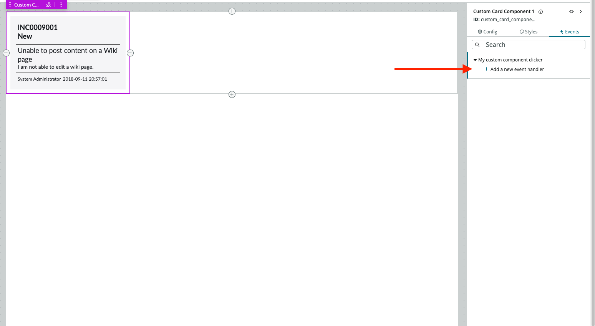

13. Assign Link to Destination even handler and give it table and sysId.

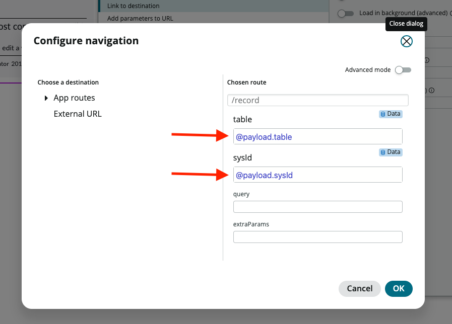

14. Save chagnes to your page and open to test. 

At this point, your custom component will open record when clicked. 