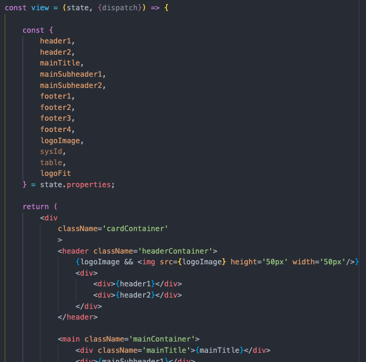

# Custom Components In Action: Simple Card

The UI Builder experience is constantly evolving, and is new to many ServiceNow developers. For this reason, there are occasionally some issues that arise that can be difficult to solve or workaround. Recently, we developed a custom component for just this reason - to rapidly build a modular and reusable component tailored specifically to our requirements, providing a quick workaround for the issue we were encountering, and available for easy iteration and adjustment looking forward.

It is, by no means, a perfect component, but the journey of creating and deploying it taught us a lot about the Now UI Framework - we're happy to share our experience, and would love to hear about yours as well!

To keep it brief, we're not going to break down every part of the process in detail - for a more detailed explanation of the different aspects of custom component creation, check out [this series of articles](https://creator-dna.com/blog/custom-components-in-the-now-experience-ui-framework-part-1-creating-a-stateful-web-component) we're publishing on [CreatorDNA](https://creator-dna.com/)!

## The Problem

We had a simple use case - we needed to display a series of cards summarizing details about specific records, with the ability to click through them to navigate to the record view for that component. The **Data set** component was working well for displaying the information, but doesn't come configured with click event for the items themselves - and the process of adding that event was a long workaround that seemed to be blocked by an obscure UI bug. Our goal was to build a barebones custom component that would afford us complete control over the data being displayed and the events being dispatched - and to learn a bit about deployment/promotion in the process.

## The Process

### Building the Component

Our component was super simple, so we're not going to go into much detail about it here. We planned to use the UIB Repeater component to map our records to an array of custom cards, so when creating the element, we kept it simple - we configured our `now-ui.json` file to allow the UIB user to input the `sys_id` and `table` for a given custom card (to use when redirecting to the record page) as well as include properties for what shows up in the various parts of the card (headers, main content, logo, etc.).


>Note: We set up our component properties as only primitives. As we soon learned, that can get a little tiresome when it comes to referencing each specific thing in the repeater, and may not be appropriate for very complex components, but works fine and keeps things generic when you only have a few properties.

These properties map to the properties configured in our `createCustomElement` function:


And are then destructured in the `view` and displayed on the DOM:



Since most of the properties we were injecting are simply strings, we only had to use a single short-circuit to conditionally render the img element, omitting it from the card header if nothing is passed via the image property. A few css rules in the `styles.scss` file controlled the inner styles, while the outer dimensions, border, margin and padding we left to be controlled by the built in UIB style panel.

From there, the next step was emitting a custom event. We destructured the `dispatch` helper (which is automatically supplied to the `view` component), created a simple `handleClick` function to dispatch an action with the type `'CUSTOM_CARD_COMPONENT#CLICKED'`, and attached it to the outermost div of the `view`, so that a click anywhere on the card would fire the action.


### Using Component Actions in UI Builder

Here's where the tricky part comes in - at this point, we had an action that fires on click, bubbles up through the DOM, and could be used to trigger action handlers defined on our component or ancestor components (not necessary for this simple component)...however, when we logged the UIB interface, the 'Events' tab for our component remained empty.

While there *are* configuration options mentioned in the docs that seem like they should address this, none of them worked for us. Including our actions in the `now-ui.json` file according to the [Component Configuration docs](https://developer.servicenow.com/dev.do#!/reference/now-experience/sandiego/cli/now-ui-config) creates a record in the `sys_ux_lib_component_action` table, but it's unclear to us what exactly this record is for.

The solution we settled on doesn't actually require that record to be created at all - from watching [this video posted by Darren Richards](https://www.youtube.com/watch?v=fyBVjuAY1wo), we discovered that there's a two-step workaround for getting UI Builder to recognize the events.

1. First, to allow UIB to recognize the event, create a new record in `sys_ux_event`. It should contain a Label (can be anything), an Event Name (the name of the action, ex: CUSTOM_CARD_COMPONENT#CLICKED), and, for the `@payload` autofill options to work correctly in the UIB event handlers, the Properties field must contain an array of objects containing (at least) a `name` key corresponding to each property of the payload that we want to target. 

>Note: We noticed the properties field for many of the events in this table corresponded exactly to the properties as defined in the `now-ui.json` properties array (including "fieldType", "label", "description", etc.). This is easier to copy/paste over, but we're unsure whether anything but the name is actually necessary. Simply including `[{"name": "sysId"}, {"name": "table"}]` worked for our purposes, allowing UI builder to recognize the `@payload` and provide the list of keys it contains.

2. Second, to get the event to actually show up in the UIB sidebar when the component is selected, navigate to the `sys_ux_macroponent` table, search by the name of your custom component, and click the lock for 'Dispatched Events'. Reference the event we just created in `sys_ux_event`, and save the record.

At with these two steps complete, the custom event appears in the component sidebar, it can be mapped just like any other UIB event, and the payload values can be used in event handlers by clicking the 'Dynamic Data Binding' button above a field and using the `@payload` variable.

For our component, we had already created a UIB page to display a record (based on the template) and set it up with required parameters of `table` and `sysId`, so all that was left was to add the inherited 'Link to destination' event handler on our newly visible click event, and configure it as normal, choosing the 'Record' App route and using `@payload` to pass the required parameters.

While we did eventually get this working, we still have a lot of questions - and some aspects of the process are definitely not working as intended. For instance, using `--force` when deploying will delete and re-create the `sys_ux_macroponent` record, so part of our deployment checklist includes re-referencing that Dispatched Event on every deployment. Also, the [Action Config](https://developer.servicenow.com/dev.do#!/reference/now-experience/sandiego/ui-framework/main-concepts/action-config) docs say to "Watch this space for changes to the APIs," so we're hopeful that those changes will address this workaround, and streamline the deployment process.

### The Repeater Component

The above describes the necessary steps to get a single component with custom events working, but our ultimate goal was to render an entire series of cards from a list of records - to do that, we went by the books, by adding a data resource instance and using the built-in UIB Repeater component.

Data resources are very handy and quick-to-use in UIB - clicking the pancakes (database) icon in the left navigation bar opens the Data resource instances panel. From there, it's relatively simple to add a new resource by searching for the global-scoped 'Look Up Records' resource, and configuring it to return an array of objects representing the records we want to display. The preview is particularly helpful, especially if we want to display data from references, as it could potentially be nested pretty deeply, and doesn't follow the dot-walking syntax found elsewhere in ServiceNow.

We were surprised to find out that data resource syntax isn't even typical javascript - for example, the following expression would target the email address of the user referenced on the first item of a data resource (with the name `lookup_records_1`), previewed in the image below (note the lack of square brackets to target index 0 of the array, and the use of `_reference` rather than just dot-walking):

```
@data.lookup_records_1.0.assigned_to._reference.email.value;
// @data.<data-resource>.<index>.<field>._reference.<referenced-record-field>.<value/displayValue>
```


## Other stuff

- Having to restart a brand new app

## Reflection

- Composition with the repeater
- Turns out, a lot of what we did wasn't strictly necessary.
